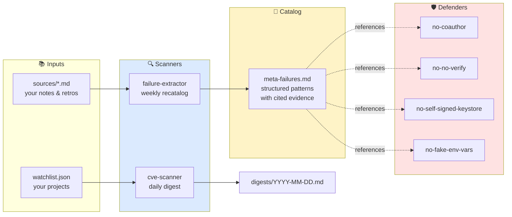

<div align="center">

# 🛡️ Self-Improving Agents

**Defensive automation for [Claude Code](https://claude.com/code) — block the mistakes you already learned about, before they happen again.**

[](#install)
[](#hooks)
[](https://claude.com/code)
[](LICENSE)
[](#)

</div>

---

## Why this exists

Claude Code is excellent — but it makes the same mistakes more than once. A `git commit --no-verify` here. A self-signed keystore that nukes your Google Sign-In there. A `.env.example` listing variables that aren't read by any line of your code.

Memory files document those mistakes, but memory is *passive* — the model can read it, ignore it, and proceed. **This repo makes the lessons active.**

```
┌───────────────────────────────────────────────────────────────┐
│  Memory:  "Don't do X."   →   Model: "Got it. Proceeds to do X."│
│                                                                │
│  Hook:    "Don't do X."   →   Tool call BLOCKED at exit 2.    │
└───────────────────────────────────────────────────────────────┘
```

---

## What's inside



| Layer | What it does | When it fires |
|-------|--------------|---------------|
| **🛡️ PreToolUse hooks** | Block known bad tool calls (exit 2 with reason). Each hook has a single-use bypass env var. | On every relevant `Bash` / `Write` / `Edit` invocation |
| **🧠 Pattern catalog** | YAML-in-Markdown registry of failure patterns, each cited from a real source note. | Read by hooks (which knows their pattern ID) |
| **🔍 Failure extractor** | Subagent that mines your notes and updates the catalog. Cite-or-reject discipline. | On demand via `/self-improving-meta-learn`, or weekly cron |
| **🔍 CVE scanner** | Subagent that queries GitHub Security Advisories for your dependencies, writes a daily digest. | On demand via `/self-improving-cve-digest`, or daily cron |

---

## 🚀 Quick start

**Prerequisites:** macOS, `jq`, `python3`, `git`. Optional but recommended: [`gh`](https://cli.github.com/) (for the CVE scanner), [`coreutils`](https://formulae.brew.sh/formula/coreutils) (for `gtimeout`).

```sh
git clone https://github.com/<you>/self-improving-agents.git
cd self-improving-agents
sh install.sh
```

The installer:
1. Verifies prerequisites
2. Creates `~/.claude/self-improving/{data,digests,config,sources,logs}/`
3. Installs hooks to `~/.claude/hooks/self-improving/`
4. Installs subagent + skill definitions to `~/.claude/{agents,skills}/`
5. Runs the hook test suite (13 tests — all must pass before next step)
6. Patches `~/.claude/settings.json` (backup at `settings.json.pre-self-improving.bak`)
7. Optionally bootstraps two macOS `launchd` cron jobs

**Re-running `install.sh` is idempotent** — pull updates from this repo, re-run, and only the changed pieces are updated.

---

## 🛡️ Hooks in detail

| Hook | Blocks | Bypass env var | Defense for pattern |
|------|--------|----------------|---------------------|
| `no-coauthor-without-flag.sh` | `git commit` containing `Co-Authored-By:` | `ALLOW_COAUTHOR=1` | `COAUTHOR_AND_LINKS` |
| `no-no-verify.sh` | `--no-verify`, `--no-gpg-sign`, `commit.gpgsign=false` | `ALLOW_NO_VERIFY=1` | `SHORTCUTS_OVER_CANONICAL` |
| `no-self-signed-keystore.sh` | `keytool -genkey`, `openssl req -newkey ... -keyout` | `ALLOW_KEYGEN=1` | `SHORTCUTS_OVER_CANONICAL` |
| `no-fake-env-vars.sh` | Writing `.env*` declaring variables not referenced anywhere in cwd | `ALLOW_FAKE_ENV=1` | `INVENTED_ENV_VARS` |

**Global kill switch:** `export SELF_IMPROVING_AGENTS_DISABLED=1` — every hook becomes a no-op until you unset it.

### How a hook fires

```
Claude wants to run:  git commit --no-verify -m "skip the hook"
                                ↓
                  PreToolUse:Bash chain
                                ↓
                  no-no-verify.sh reads stdin (JSON)
                                ↓
                  matches --no-verify substring → exit 2
                                ↓
                  Claude Code shows:
                  "BLOCKED by self-improving-hooks: Command uses --no-verify ..."
                                ↓
                  git is never invoked
```

### Running the tests yourself

```sh
sh hooks/test.sh
# Expected: Results: 13 passed, 0 failed
```

Positive + negative + bypass test per hook. The installer refuses to patch `settings.json` if any test fails.

### Adding your own hook

See [hooks/README.md](hooks/README.md). Three files to touch: the hook script, `test.sh`, and `settings.json`.

---

## 🔍 CVE scanner

Watchlist your active projects in `~/.claude/self-improving/config/dependencies-watchlist.json`:

```jsonc
{
  "projects": [
    {
      "name": "my-web-app",
      "path": "/absolute/path/to/project",
      "manifests": ["package.json"],
      "ecosystem": "npm",         // npm | pip | cargo
      "priority": "high",
      "active": true
    }
  ]
}
```

The scanner queries [GitHub Security Advisories](https://github.com/advisories) per dependency, deduplicates, and writes:

```markdown
# CVE Digest — 2026-XX-XX

**Scanned:** 5 projects, 77 unique packages.
**New advisories (last 7 days):** 3.
**Critical:** 0. **High:** 1. **Medium+Low:** 2.

## High
- **GHSA-xxxx-xxxx-xxxx** — `framework@1.2.3` (project: my-web-app)
  Title: ...
  Action: bump to 1.2.5
  Link: https://github.com/advisories/GHSA-...
```

**Critical findings trigger `PushNotification`** (native Claude Code notification). Lower severities go silently into the digest file.

Manual run: `/self-improving-cve-digest`. Daily cron run: see [Scheduling](#-scheduling).

### 📧 Email notifications (optional)

If you want the digest delivered to your inbox — useful when the daily cron fires while you're away from your machine — drop a config file at `~/.claude/self-improving/config/email.json`:

```sh
cp templates/email.example.json ~/.claude/self-improving/config/email.json
chmod 600 ~/.claude/self-improving/config/email.json
# then edit the api_key, from, to fields
```

The scanner uses [Resend](https://resend.com) (free tier: 3000 emails/month, no credit card). Sign up, verify a sending domain, and paste the API key into `email.json`. Adjust `send_on` to filter which severity levels trigger email:

```jsonc
{
  "provider": "resend",
  "api_key": "re_xxxxxxxxxxxx",
  "from": "self-improving@yourverifieddomain.com",
  "to": "you@example.com",
  "send_on": ["critical", "high"]   // or ["critical","high","medium","low"] for everything
}
```

Findings below the threshold still land in the local digest file — email only carries what the threshold matches. If `email.json` is absent, email delivery is silently skipped (no error). The API key is never logged.

If Resend isn't your thing: write a small wrapper that reads the digest file and pipes it through your preferred mail transport (`mailx`, `msmtp`, AWS SES, etc.). PRs adding alternate providers welcome.

---

## 🧠 Failure pattern catalog

Patterns live in `~/.claude/self-improving/data/meta-failures.md` as YAML blocks. See [examples/example-pattern.md](examples/example-pattern.md) for a complete annotated entry.

The catalog starts **empty**. You populate it by:

1. **Manual edit** — open the file, append a pattern (use the example as a template).
2. **`/self-improving-meta-learn`** — dispatches the failure-extractor subagent, which reads `~/.claude/self-improving/sources/*.md` and extracts patterns with cite-or-reject discipline.

To feed the extractor with your existing notes:

```sh
# Option A: symlink your Claude Code memory dir
ln -s ~/.claude/projects/<your-project-encoded>/memory ~/.claude/self-improving/sources/memory

# Option B: drop ad-hoc notes
echo "I keep telling Claude not to ..." > ~/.claude/self-improving/sources/my-notes.md
```

---

## ⏰ Scheduling

The installer optionally creates two macOS `launchd` agents:

| Job | Schedule (local) | Budget cap | Logs |
|-----|------------------|------------|------|
| `com.self-improving.cve-daily` | Daily 09:00 | $0.50/run | `~/.claude/self-improving/logs/cve-daily.{out,err}.log` |
| `com.self-improving.weekly-recatalog` | Sunday 09:00 | $1.00/run | `~/.claude/self-improving/logs/weekly-recatalog.{out,err}.log` |

Both invoke `claude -p` in headless mode. They run even when Claude Code UI is closed, and fire on next wake if the Mac was asleep.

### Manual trigger

```sh
launchctl kickstart -k gui/$(id -u)/com.self-improving.cve-daily
```

### Inspect

```sh
launchctl list | grep self-improving
launchctl print gui/$(id -u)/com.self-improving.cve-daily | head -50
tail -20 ~/.claude/self-improving/logs/cve-daily.err.log
```

### Change schedule

Edit the plist's `StartCalendarInterval` (`Hour`, `Minute`, `Weekday` for weekly), then:

```sh
launchctl bootout gui/$(id -u) ~/Library/LaunchAgents/com.self-improving.cve-daily.plist
launchctl bootstrap gui/$(id -u) ~/Library/LaunchAgents/com.self-improving.cve-daily.plist
```

### Linux / Windows

`launchd` is macOS-only. On Linux, use `systemd --user` units or cron with the same `claude -p` invocation. PRs welcome.

---

## 💰 Cost

Token cost per scheduled run depends on findings and your active model:

| Run | Typical | Hard cap |
|-----|---------|----------|
| Daily CVE | $0.10–0.30 | $0.50 (via `--max-budget-usd`) |
| Weekly recatalog | $0.20–0.50 | $1.00 |

**Annual upper bound:** ~$180/year if every run hits the cap. Typical use closer to $50–100/year. Both caps adjustable in the plist.

Manual `/self-improving-cve-digest` and `/self-improving-meta-learn` run on whatever model your current Claude Code session uses — no separate cap.

---

## 🗂️ File layout after install

```
~/.claude/
├── agents/
│   ├── self-improving-failure-extractor.md
│   └── self-improving-cve-scanner.md
├── skills/
│   ├── self-improving-meta-learn.md
│   └── self-improving-cve-digest.md
├── hooks/self-improving/
│   ├── _lib.sh
│   ├── no-coauthor-without-flag.sh
│   ├── no-no-verify.sh
│   ├── no-self-signed-keystore.sh
│   ├── no-fake-env-vars.sh
│   ├── test.sh
│   └── README.md
├── self-improving/
│   ├── data/meta-failures.md       ← your pattern catalog
│   ├── digests/YYYY-MM-DD.md       ← CVE scan output
│   ├── config/dependencies-watchlist.json
│   ├── sources/                    ← your notes (read by failure-extractor)
│   └── logs/                       ← launchd stdout/stderr
└── settings.json                   ← patched (backup at .pre-self-improving.bak)

~/Library/LaunchAgents/
├── com.self-improving.cve-daily.plist
└── com.self-improving.weekly-recatalog.plist
```

---

## 🧹 Uninstall

```sh
sh uninstall.sh
```

Unloads launchd jobs, restores `settings.json` from backup (or strips our entries if no backup), removes all installed files. **Everything is reversible.**

---

## 🤝 Contributing

Pull requests welcome. Especially useful:

- **New hooks** — pick a pattern other Claude Code users hit too, write hook + tests, open a PR.
- **Linux/systemd support** — port the launchd plists to systemd user units.
- **Ecosystem coverage in the CVE scanner** — currently npm/pip/cargo. Adding `composer`, `gem`, `go`, `swift` is straightforward.
- **Better failure-extractor prompts** — the cite-or-reject rule prevents hallucinated patterns, but the dedup logic could be smarter.

See [CONTRIBUTING.md](CONTRIBUTING.md) for the dev workflow.

---

## 📜 License

[MIT](LICENSE).

---

<div align="center">

*A small system that learns from your mistakes so your agents don't keep making them.*

</div>
